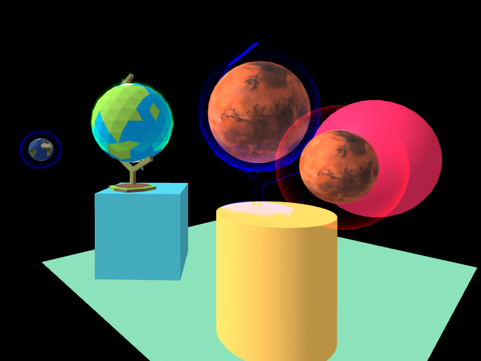

### This component was developed in partnership with [Planet Voodoo® (Voodoo LLC)](https://planetvoodoo.org/) as part of their 'WebXR Wizardry' initiative.

## Glow

Based on the <a href="https://github.com/stemkoski/stemkoski.github.com/blob/master/Three.js/Shader-Glow.html">work of Lee Stemkoski</a>

### Usage

Attach the component to any primitive, or gltf model:

    <script src="https://gftruj.github.io/webzamples/PlanetVoodoo/glow/dist/glow-component.js"
    <a-scene>
      <a-sphere glow></a-sphere>
      <a-entity gltf-model="model.gltf" glow>
    </a-scene>

### Properties

| Property        | Default       |
| -------------   |:-------------:|
| intensityPower  | 2.4           |
| intensityBase   | 1.0           | 
| glowColor       | #ff0          |

The glow is calculated as follows:

    intensity = pow( intensityBase - <entity normal vs view normal>, intensityPower );
    finalColor = glowColor * intensity;
    
Where intensityPower, intensityBase, and glowColor correspond to the components properties.

### Notes

The glow material uses `THREE.AdditiveBlending` so it looks good with darker backgrounds. 
